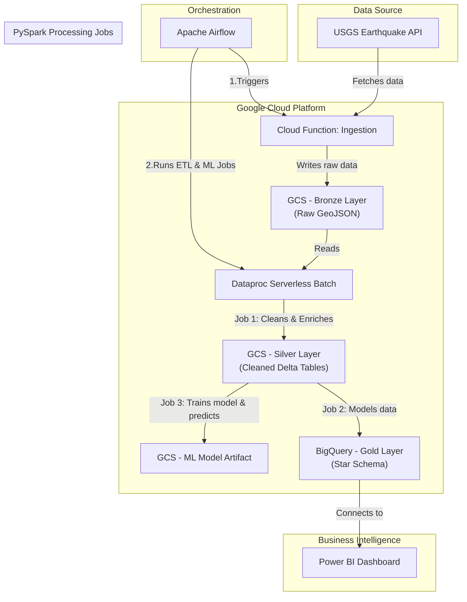

# End-to-End Earthquake Analysis ETL Pipeline with ML and Power BI


This project implements a complete, automated, end-to-end data pipeline on Google Cloud Platform. It ingests global earthquake data from the USGS API, processes it through a robust Medallion architecture, trains a machine learning model to predict tsunami likelihood, and loads the modeled data into a BigQuery data warehouse. The entire workflow is orchestrated with Apache Airflow.

The final output is a dynamic, interactive Power BI dashboard for visualizing seismic trends, geographical hotspots, and trends.


## Key Features

*   **Serverless Ingestion**: A Google Cloud Function automatically fetches the latest earthquake data on a schedule.
*   **Medallion Architecture**: Data is systematically refined through **Bronze** (raw), **Silver** (cleaned & enriched), and **Gold** (analytics-ready) layers using Delta Lake and BigQuery.
*   **Scalable Data Processing**: Large-scale data transformation and feature engineering are handled efficiently by PySpark jobs running on Dataproc Serverless.
*   **Predictive Machine Learning**:
    *   **Tsunami Prediction**: A Random Forest classifier is trained to predict whether an earthquake will generate a tsunami warning.
    *   **Model Management**: The trained model artifact is versioned and stored in Google Cloud Storage.
*   **Reliable Orchestration**: The entire multi-step pipeline is managed and scheduled by an Apache Airflow DAG, ensuring dependencies and retries are handled correctly.
*   **Dimensional Modeling**: The Gold layer in BigQuery is structured as a star schema, optimized for fast and intuitive BI queries.
*   **Interactive Visualization**: Includes a comprehensive Power BI dashboard for deep data exploration and insight discovery.

## Architecture Diagram

The data flows through the system as follows:


## Tech Stack
* **Component**:	Technology / Service
* **Cloud Provider**:	Google Cloud Platform (GCP)
* **Orchestration**:	Apache Airflow
* **Data Ingestion**:	Google Cloud Functions (Python)
* **Data Lake Storage**:	Google Cloud Storage (GCS)
* **Data Format**:	JSON, Delta Lake
* **Data Processing**:	Apache Spark (PySpark) on Dataproc Serverless
* **Data Warehouse**:	Google BigQuery
* **Machine Learning**:	PySpark MLlib (RandomForestClassifier)
* **Visualization**: & BI	Microsoft Power BI
## Project Structure

```
.
├── cloud_function/
│   ├── main.py              # Python code for the ingestion function.
│   └── requirements.txt     # Dependencies for the Cloud Function.
├── dags/
│   └── earthquake_etl_dag.py  # The main Airflow DAG file.
├── scripts/
│   ├── process_bronze_to_silver.py # PySpark job for cleaning data.
│   ├── process_silver_to_gold.py   # PySpark job for dimensional modeling.
│   └── train_tsunami_model.py      # PySpark job for ML model training.
└── README.md
```
## Setup and Installation
Prerequisites
A Google Cloud Platform project with billing enabled.
Google Cloud SDK (gcloud CLI) installed and authenticated.
An Apache Airflow instance (e.g., Google Cloud Composer).
Permissions to manage GCS, Cloud Functions, Dataproc, and BigQuery.
### 1. Clone the Repository
```
Bash
git clone https://github.com/your-username/earthquake-data-pipeline.git
cd earthquake-data-pipeline
```
### 2. Set Up GCP Resources
**Create: GCS Bucket**: This bucket will store data, scripts, and model artifacts.
```
export GCS_BUCKET_NAME="your-unique-bucket-name"
export GCP_REGION="us-central1" # Or your preferred region
gsutil mb -l $GCP_REGION gs://$GCS_BUCKET_NAME
```
**Create BigQuery Dataset**: This will host your Gold layer tables.
```
export GCP_PROJECT_ID=$(gcloud config get-value project)
bq --location=$GCP_REGION mk --dataset ${GCP_PROJECT_ID}:gold_earthquakes
```
**Upload Scripts to GCS**:
```
gsutil cp -r scripts/ gs://$GCS_BUCKET_NAME/scripts/
```
### 3. Deploy the Cloud Function
Deploy the ingestion function from its directory.
```
cd cloud_function/
gcloud functions deploy ingest-earthquakes \
  --runtime python39 \
  --trigger-http \
  --allow-unauthenticated \
  --region $GCP_REGION \
  --set-env-vars GCS_BUCKET_NAME=$GCS_BUCKET_NAME
```
**Note**: After deployment, copy the https trigger URL. You will need it for the Airflow connection.
### 4. Configure Airflow
```
Add Variables: In the Airflow UI, navigate to Admin -> Variables and create the following:
gcs_project_id: Your GCP Project ID.
gcs_bucket: The name of your GCS bucket.
gcs_region: The GCP region you are using (e.g., us-central1).
```
Add HTTP Connection: Navigate to Admin -> Connections and create a new HTTP connection:
```
Conn Id: cloud_run_conn
Conn Type: HTTP
Host: The trigger URL you copied from your Cloud Function deployment (e.g., https://us-central1-your-project.cloudfunctions.net).
Endpoint: ingest-earthquakes (or the name of your function).
```
**Upload the DAG**: Upload the dags/earthquake_etl_dag.py file to your Airflow DAGs folder.

## Usage
1. Navigate to the Airflow UI.
2. Find the DAG named earthquake_etl_and_ml_pipeline and un-pause it using the toggle switch.
3. The DAG is scheduled to run daily. To execute it immediately, click the "Play" button on the right to trigger a manual run.
4. You can monitor the progress of each task (ingest, process_bronze_to_silver, etc.) in the Grid View.
## The Power BI Dashboard
The final product is a powerful analytics dashboard that provides deep insights into the processed data.
### Connecting Power BI to BigQuery
1.  In Power BI Desktop, select Get Data -> More... -> Google BigQuery.
2.  Sign in with your Google account that has access to the GCP project.
3.  Navigate to your project and select the tables within the gold_earthquakes dataset.
4.  Load the data and build relationships between the fact and dimension tables in the Model view.
### Dashboard Layout

It includes:
* **KPI Cards**: High-level metrics like total events, average magnitude, and tsunami warnings issued.
* **Geospatial Analysis**: An interactive map showing earthquake locations, with bubble size representing magnitude.
* **Temporal Trends**: A line chart showing seismic activity over time.